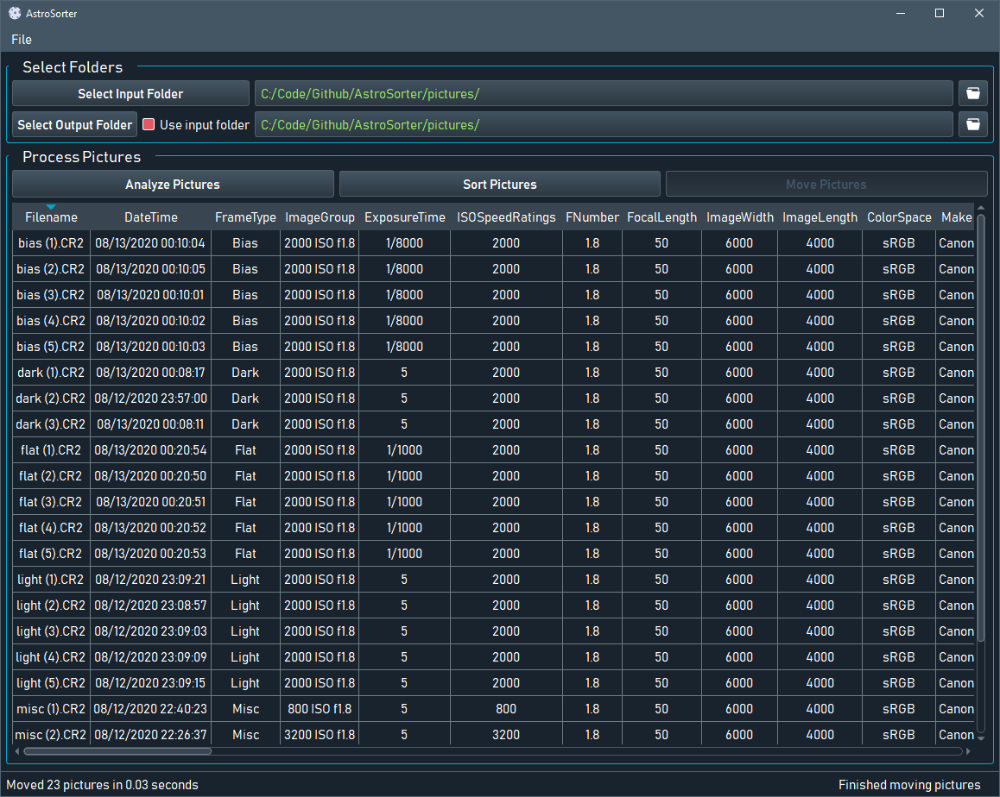

# AstroSorter
A PyQt5-based application to assist with sorting astrophotography images based on frame type (bias, dark, light, and flat).

*Currently only tested on Windows 10 with Canon .CR2 raw files.*

**Dependencies:**

* PyQt5
* pyqt5ac
* Numpy
* PIL
* imageio
* RawPy
* exifread
* pickle
* configparser

**DISCLAIMER: I am not responsible for any lost photos or corrupted files (shouldn't happen, but you never know). Please test it with copies of your photos first.**

**Usage:**  
1. Select input and output folders using the corresponding buttons (or use the input folder as the output folder by checking the checkbox).
2. Click "Analyze Pictures" to get a picture list with associated metadata for each file.
3. Click "Sort Pictures" to automatically determine the frame type for each file and move them into corresponding folders in the destination folder.
    

**Planned features:** 
* Selecting which calibration frames to look for (bias, flat, dark)
* Manually designate frame types for files
* Image previews
* Button to open input/output folders or individual images
* Sorting multiple capture series (currently just handles one)

**Things I need help testing:**
* Other picture formats besides .CR2
* Other color spaces besides sRGB (such as ZWO grayscale cameras)

**Things that probably cannot be added:**
* Automatically sorting panorama or mosaic photos

